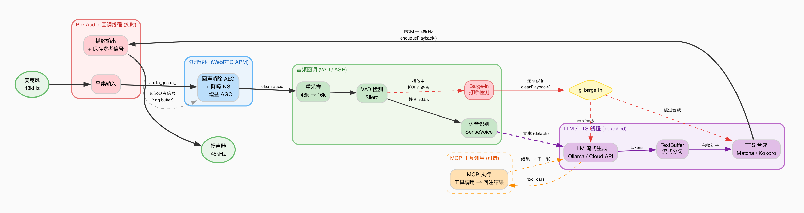

# E2E Voice - 端到端语音对话系统

C++17 端到端中文智能语音对话系统，集成 ASR（语音识别）、LLM（大语言模型）、TTS（语音合成）、VAD（语音活动检测）和 AEC（全双工回声消除）。

[English](README_EN.md)

> [!IMPORTANT]
> **分支说明**
>
> - **`master` 分支**：保留原始单体架构代码，**不再更新**
> - **`refactor` 分支**：当前活跃开发分支，后续所有开发基于此分支
>
> **重构改进（master → refactor）**
>
> 基于 288 个文件变更（净减少 ~136 万行代码），核心改进如下：
>
> 1. **模块化架构** — 6 个核心模块（audio / stt / tts / vad / llm / mcp）拆分为独立 Git 子仓库（submodule），可单独开发、测试、复用
> 2. **全双工语音对话** — 新增 WebRTC AEC 回声消除管道（`voice_chat_aec`），支持 Barge-in 打断，替代原有半双工方案
> 3. **去除冗余代码** — 移除内嵌的 third_party（cppjieba、cpp-pinyin、cpp-mcp 等），改用 CMake FetchContent 按需拉取
> 4. **统一 API 规范** — 每个模块提供标准化的 `*_api.hpp` 公共头文件和 `API.md` 文档
> 5. **Python 绑定** — audio / stt / tts / vad 提供 pybind11 接口，支持 `pip install -e .`
> 6. **清理遗留代码** — 移除旧的 Python 脚本、遗留 C++ 示例、build.sh 等

## 特性

- **全双工对话** — WebRTC AEC 回声消除 + 噪声抑制，支持 Barge-in 打断
- **离线语音识别** — SenseVoice ONNX，支持中/英/日/韩/粤多语言
- **多后端语音合成** — Matcha-TTS（中/英/中英混合）+ Kokoro（多音色）
- **LLM 集成** — Ollama 本地推理 / OpenAI 兼容云端 API，流式输出
- **MCP 工具调用** — 通过 Model Context Protocol 扩展 LLM 能力（可选）
- **模块化架构** — audio / stt / tts / vad / llm / mcp 独立模块，可单独使用
- **Python 绑定** — audio / stt / tts / vad 提供 pybind11 Python 接口

## 架构

### 全双工 AEC 管道



### 模块化架构

| 模块 | 路径 | 说明 | Python 包 |
|------|------|------|-----------|
| **Audio** | [`modules/audio/`](modules/audio/README.md) | 音频采集 / 播放 / 全双工 / 重采样 | `evo_audio` |
| **STT** | [`modules/stt/`](modules/stt/README.md) | SenseVoice 语音识别 | `evo_asr` |
| **TTS** | [`modules/tts/`](modules/tts/README.md) | Matcha / Kokoro 语音合成 | `evo_tts` |
| **VAD** | [`modules/vad/`](modules/vad/README.md) | Silero 语音活动检测 | `evo_vad` |
| **LLM** | [`modules/llm/`](modules/llm/README.md) | Ollama / OpenAI 兼容 API 客户端 | — |
| **MCP** | [`modules/mcp/`](modules/mcp/README.md) | MCP 客户端 SDK（stdio / socket / HTTP） | — |

## 依赖

<table>
<tr><th>Ubuntu / Debian</th><th>macOS</th></tr>
<tr>
<td>

```bash
sudo apt install gcc g++ cmake pkg-config \
  libportaudio-dev libsndfile1-dev \
  libcurl4-openssl-dev libfftw3-dev \
  libssl-dev espeak-ng libabsl-dev
```

ONNX Runtime 需手动安装，参见 [ONNX Runtime Releases](https://github.com/microsoft/onnxruntime/releases)：

```bash
wget https://github.com/microsoft/onnxruntime/releases/download/v1.20.0/onnxruntime-linux-x64-1.20.0.tgz
tar -xzf onnxruntime-linux-x64-1.20.0.tgz
sudo cp -r onnxruntime-linux-x64-1.20.0/include/* /usr/local/include/
sudo cp -r onnxruntime-linux-x64-1.20.0/lib/* /usr/local/lib/
sudo ldconfig
```

</td>
<td>

```bash
brew install gcc cmake pkg-config \
  portaudio libsndfile curl fftw \
  onnxruntime espeak openssl abseil
```

</td>
</tr>
</table>

**本地 LLM（Ollama）：**

```bash
curl -fsSL https://ollama.ai/install.sh | sh
ollama pull qwen2.5:0.5b
```

## 编译与运行

### 编译

```bash
git clone --recursive https://github.com/muggle-stack/e2e_Voice.git
cd e2e_Voice
mkdir -p build && cd build
cmake .. && make -j$(nproc 2>/dev/null || sysctl -n hw.ncpu)
```

**CMake 选项：**

| 选项 | 默认 | 说明 |
|------|------|------|
| `USE_AEC` | `ON` | WebRTC 回声消除（全双工 Barge-in） |
| `USE_MCP` | `OFF` | Model Context Protocol 工具调用 |

```bash
# 启用 MCP 工具调用
cmake -DUSE_MCP=ON .. && make -j$(nproc 2>/dev/null || sysctl -n hw.ncpu)
```

> **注意：** AEC 需要先编译 WebRTC 模块：`cd modules/webrtc-audio-processing && meson build && ninja -C build`

### 运行

```bash
./build/bin/voice_chat_aec                                     # 默认配置
./build/bin/voice_chat_aec --tts kokoro --model qwen2.5:7b     # Kokoro TTS + 更大模型
./build/bin/voice_chat_aec -l                                  # 列出音频设备
./build/bin/voice_chat_aec --mcp-config mcp.json               # 启用工具调用
./build/bin/voice_chat_aec --llm-url https://api.example.com/v1/chat/completions  # 云端 LLM
```

### 运行时选项

| 参数 | 说明 | 默认值 |
|------|------|--------|
| `-i`, `--input-device <id>` | 输入设备索引 | 系统默认 |
| `-o`, `--output-device <id>` | 输出设备索引 | 系统默认 |
| `-l`, `--list-devices` | 列出可用音频设备 | — |
| `--tts <engine>` | TTS 后端（`matcha:zh` / `matcha:en` / `matcha:zh-en` / `kokoro` / `kokoro:<voice>`） | `matcha:zh` |
| `--model <name>` | LLM 模型名称 | `qwen2.5:0.5b` |
| `--llm-url <url>` | LLM API 地址（OpenAI 兼容） | Ollama 本地 |
| `--no-aec` | 禁用回声消除 | — |
| `--no-ns` | 禁用噪声抑制 | — |
| `--agc` | 启用自动增益控制 | 禁用 |
| `--aec-delay <ms>` | AEC 延迟补偿 | `50` |
| `--buffer-frames <n>` | 音频缓冲帧数 | macOS `480` / Linux `960` |
| `--sample-rate <hz>` | 音频采样率 | `48000` |
| `--save-audio [file]` | 保存 AEC 处理后的音频 | `aec_debug.wav` |
| `--mcp-config <path>` | MCP 配置文件（启用工具调用） | — |

### 组件演示

各模块提供独立的可执行演示：

```bash
./build/bin/stt_test audio.wav       # 文件语音识别
./build/bin/simple_demo --text "你好" # TTS 语音合成
./build/bin/vad_simple_demo          # VAD 语音活动检测
./build/bin/audio_demo -l            # 音频设备列表
```

## Python 绑定

4 个核心模块提供 pybind11 Python 接口：

```bash
cd modules/audio/python && pip install -e .   # evo_audio
cd modules/stt/python   && pip install -e .   # evo_asr
cd modules/tts/python   && pip install -e .   # evo_tts
cd modules/vad/python   && pip install -e .   # evo_vad
```

详细用法参见各模块 README。

## 模型缓存

首次运行时自动下载到 `~/.cache/`：

```
~/.cache/
├── sensevoice/                          # ASR (SenseVoice ONNX)
├── matcha-tts/
│   ├── matcha-icefall-zh-baker/         # 中文 TTS (22050Hz)
│   ├── matcha-icefall-en_US-ljspeech/   # 英文 TTS (22050Hz)
│   ├── matcha-icefall-zh-en/            # 中英混合 TTS (16000Hz)
│   ├── vocos-22khz-univ.onnx           # Vocoder (中文/英文)
│   └── vocos-16khz-univ.onnx           # Vocoder (中英混合)
└── silero_vad.onnx                      # VAD (Silero)
```

## 许可证

MIT License — 详见 [LICENSE](LICENSE)

## 致谢

- [ONNX Runtime](https://github.com/microsoft/onnxruntime) — 高性能推理引擎
- [SenseVoice](https://github.com/FunAudioLLM/SenseVoice) — 语音识别模型
- [Matcha-TTS](https://github.com/shivammehta25/Matcha-TTS) — 语音合成模型
- [Kokoro](https://github.com/hexgrad/Kokoro-82M) — 多音色语音合成
- [Vocos](https://github.com/gemelo-ai/vocos) — 声码器
- [Silero VAD](https://github.com/snakers4/silero-vad) — 语音活动检测
- [WebRTC Audio Processing](https://gitlab.freedesktop.org/pulseaudio/webrtc-audio-processing) — 回声消除 / 噪声抑制
- [PortAudio](http://www.portaudio.com/) — 跨平台音频 I/O
- [cppjieba](https://github.com/yanyiwu/cppjieba) — C++ 中文分词
- [cpp-pinyin](https://github.com/wolfgitpr/cpp-pinyin) — 中文转拼音
- [espeak-ng](https://github.com/espeak-ng/espeak-ng) — 英文音素化
- [nlohmann/json](https://github.com/nlohmann/json) — JSON 库
- [pybind11](https://github.com/pybind/pybind11) — Python 绑定
- [dengcunqin](https://modelscope.cn/models/dengcunqin/matcha_tts_zh_en_20251010) — 中英文 Matcha 模型
