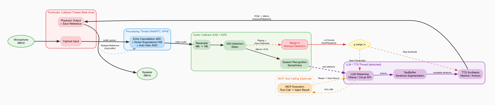

# E2E Voice - End-to-End Voice Dialogue System

A C++17 end-to-end Chinese intelligent voice dialogue system integrating ASR (Speech Recognition), LLM (Large Language Model), TTS (Text-to-Speech), VAD (Voice Activity Detection), and AEC (Full-Duplex Echo Cancellation).

[中文](README.md)

> [!IMPORTANT]
> **Branch Notice**
>
> - **`master` branch**: Retains the original monolithic codebase and is **no longer updated**
> - **`refactor` branch**: The current active development branch — all future development is based on this branch
>
> **Key Improvements (master → refactor)**
>
> Based on 288 file changes (net reduction of ~1.36 million lines of code):
>
> 1. **Modular Architecture** — 6 core modules (audio / stt / tts / vad / llm / mcp) split into independent Git submodules, enabling standalone development, testing, and reuse
> 2. **Full-Duplex Voice Conversation** — New WebRTC AEC echo cancellation pipeline (`voice_chat_aec`) with Barge-in support, replacing the previous half-duplex approach
> 3. **Removed Bloat** — Eliminated embedded third_party sources (cppjieba, cpp-pinyin, cpp-mcp, etc.), replaced with CMake FetchContent for on-demand fetching
> 4. **Unified API Convention** — Each module provides a standardized `*_api.hpp` public header and `API.md` documentation
> 5. **Python Bindings** — audio / stt / tts / vad provide pybind11 interfaces, installable via `pip install -e .`
> 6. **Legacy Cleanup** — Removed old Python scripts, legacy C++ examples, build.sh, and other obsolete files

## Features

- **Full-Duplex Conversation** — WebRTC AEC echo cancellation + noise suppression with Barge-in support
- **Offline Speech Recognition** — SenseVoice ONNX, supporting Chinese / English / Japanese / Korean / Cantonese
- **Multi-Backend TTS** — Matcha-TTS (Chinese / English / Mixed) + Kokoro (multi-voice)
- **LLM Integration** — Ollama local inference / OpenAI-compatible cloud APIs, streaming output
- **MCP Tool Calling** — Extend LLM capabilities via Model Context Protocol (optional)
- **Modular Architecture** — Independent audio / stt / tts / vad / llm / mcp modules, usable standalone
- **Python Bindings** — pybind11 Python interfaces for audio / stt / tts / vad

## Architecture

### Full-Duplex AEC Pipeline



### Modular Architecture

| Module | Path | Description | Python Package |
|--------|------|-------------|----------------|
| **Audio** | [`modules/audio/`](modules/audio/README.md) | Audio capture / playback / full-duplex / resampling | `evo_audio` |
| **STT** | [`modules/stt/`](modules/stt/README.md) | SenseVoice speech recognition | `evo_asr` |
| **TTS** | [`modules/tts/`](modules/tts/README.md) | Matcha / Kokoro speech synthesis | `evo_tts` |
| **VAD** | [`modules/vad/`](modules/vad/README.md) | Silero voice activity detection | `evo_vad` |
| **LLM** | [`modules/llm/`](modules/llm/README.md) | Ollama / OpenAI-compatible API client | — |
| **MCP** | [`modules/mcp/`](modules/mcp/README.md) | MCP client SDK (stdio / socket / HTTP) | — |

## Dependencies

<table>
<tr><th>Ubuntu / Debian</th><th>macOS</th></tr>
<tr>
<td>

```bash
sudo apt install gcc g++ cmake pkg-config \
  libportaudio-dev libsndfile1-dev \
  libcurl4-openssl-dev libfftw3-dev \
  libssl-dev espeak-ng libabsl-dev
```

ONNX Runtime must be installed manually, see [ONNX Runtime Releases](https://github.com/microsoft/onnxruntime/releases):

```bash
wget https://github.com/microsoft/onnxruntime/releases/download/v1.20.0/onnxruntime-linux-x64-1.20.0.tgz
tar -xzf onnxruntime-linux-x64-1.20.0.tgz
sudo cp -r onnxruntime-linux-x64-1.20.0/include/* /usr/local/include/
sudo cp -r onnxruntime-linux-x64-1.20.0/lib/* /usr/local/lib/
sudo ldconfig
```

</td>
<td>

```bash
brew install gcc cmake pkg-config \
  portaudio libsndfile curl fftw \
  onnxruntime espeak openssl abseil
```

</td>
</tr>
</table>

**Local LLM (Ollama):**

```bash
curl -fsSL https://ollama.ai/install.sh | sh
ollama pull qwen2.5:0.5b
```

## Build & Run

### Build

```bash
git clone --recursive https://github.com/muggle-stack/e2e_Voice.git
cd e2e_Voice
mkdir -p build && cd build
cmake .. && make -j$(nproc 2>/dev/null || sysctl -n hw.ncpu)
```

**CMake Options:**

| Option | Default | Description |
|--------|---------|-------------|
| `USE_AEC` | `ON` | WebRTC echo cancellation (full-duplex barge-in) |
| `USE_MCP` | `OFF` | Model Context Protocol tool calling |

```bash
# Enable MCP tool calling
cmake -DUSE_MCP=ON .. && make -j$(nproc 2>/dev/null || sysctl -n hw.ncpu)
```

> **Note:** AEC requires building the WebRTC module first: `cd modules/webrtc-audio-processing && meson build && ninja -C build`

### Run

```bash
./build/bin/voice_chat_aec                                     # Default configuration
./build/bin/voice_chat_aec --tts kokoro --model qwen2.5:7b     # Kokoro TTS + larger model
./build/bin/voice_chat_aec -l                                  # List audio devices
./build/bin/voice_chat_aec --mcp-config mcp.json               # Enable tool calling
./build/bin/voice_chat_aec --llm-url https://api.example.com/v1/chat/completions  # Cloud LLM
```

### Runtime Options

| Argument | Description | Default |
|----------|-------------|---------|
| `-i`, `--input-device <id>` | Input device index | System default |
| `-o`, `--output-device <id>` | Output device index | System default |
| `-l`, `--list-devices` | List available audio devices | — |
| `--tts <engine>` | TTS backend (`matcha:zh` / `matcha:en` / `matcha:zh-en` / `kokoro` / `kokoro:<voice>`) | `matcha:zh` |
| `--model <name>` | LLM model name | `qwen2.5:0.5b` |
| `--llm-url <url>` | LLM API URL (OpenAI-compatible) | Ollama local |
| `--no-aec` | Disable echo cancellation | — |
| `--no-ns` | Disable noise suppression | — |
| `--agc` | Enable automatic gain control | Disabled |
| `--aec-delay <ms>` | AEC delay compensation | `50` |
| `--buffer-frames <n>` | Audio buffer frame count | macOS `480` / Linux `960` |
| `--sample-rate <hz>` | Audio sample rate | `48000` |
| `--save-audio [file]` | Save AEC-processed audio | `aec_debug.wav` |
| `--mcp-config <path>` | MCP config file (enable tool calling) | — |

### Component Demos

Each module provides standalone executable demos:

```bash
./build/bin/stt_test audio.wav       # File-based speech recognition
./build/bin/simple_demo --text "你好" # TTS speech synthesis
./build/bin/vad_simple_demo          # VAD voice activity detection
./build/bin/audio_demo -l            # Audio device listing
```

## Python Bindings

Four core modules provide pybind11 Python interfaces:

```bash
cd modules/audio/python && pip install -e .   # evo_audio
cd modules/stt/python   && pip install -e .   # evo_asr
cd modules/tts/python   && pip install -e .   # evo_tts
cd modules/vad/python   && pip install -e .   # evo_vad
```

See each module's README for detailed usage.

## Model Cache

Models are automatically downloaded to `~/.cache/` on first run:

```
~/.cache/
├── sensevoice/                          # ASR (SenseVoice ONNX)
├── matcha-tts/
│   ├── matcha-icefall-zh-baker/         # Chinese TTS (22050Hz)
│   ├── matcha-icefall-en_US-ljspeech/   # English TTS (22050Hz)
│   ├── matcha-icefall-zh-en/            # Chinese-English mixed TTS (16000Hz)
│   ├── vocos-22khz-univ.onnx           # Vocoder (Chinese/English)
│   └── vocos-16khz-univ.onnx           # Vocoder (Chinese-English mixed)
└── silero_vad.onnx                      # VAD (Silero)
```

## License

MIT License — See [LICENSE](LICENSE)

## Acknowledgements

- [ONNX Runtime](https://github.com/microsoft/onnxruntime) — High-performance inference engine
- [llama.cpp](https://github.com/ggml-org/llama.cpp) — High-performance LLM inference engine
- [Ollama](https://github.com/ollama/ollama) — Local LLM runtime and management
- [SenseVoice](https://github.com/FunAudioLLM/SenseVoice) — Speech recognition model
- [Matcha-TTS](https://github.com/shivammehta25/Matcha-TTS) — Text-to-speech model
- [Kokoro](https://github.com/hexgrad/kokoro) — Multi-voice text-to-speech
- [Vocos](https://github.com/gemelo-ai/vocos) — Vocoder
- [Silero VAD](https://github.com/snakers4/silero-vad) — Voice activity detection
- [WebRTC Audio Processing](https://gitlab.freedesktop.org/pulseaudio/webrtc-audio-processing) — Echo cancellation / noise suppression
- [PortAudio](http://www.portaudio.com/) — Cross-platform audio I/O
- [cppjieba](https://github.com/yanyiwu/cppjieba) — C++ Chinese word segmentation
- [cpp-pinyin](https://github.com/wolfgitpr/cpp-pinyin) — Chinese to Pinyin conversion
- [espeak-ng](https://github.com/espeak-ng/espeak-ng) — English phonemization
- [nlohmann/json](https://github.com/nlohmann/json) — JSON library
- [pybind11](https://github.com/pybind/pybind11) — Python bindings
- [dengcunqin](https://modelscope.cn/models/dengcunqin/matcha_tts_zh_en_20251010) — Chinese-English Matcha model
